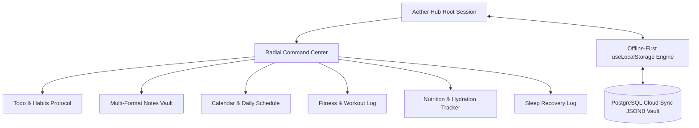

_This is a submission for [Weekend Challenge: Passion Edition](https://dev.to/challenges/weekend-2026-07-09)_

# Aether Hub: Your Go-to Logger for Everyday Activities

---

## What I Built

When pursuing passionate self-improvement—whether it's hypertrophy fitness, optimal daily nutrition, deep sleep architecture, or building technical projects—our tools often become fragmented across five different apps.

I built **Aether Hub** which tracks your **Everyday Activity** for you to review and retrospect at the end of the day.

### Core Features of Aether Hub:

- **Radial Command Center**: An interactive overview menu providing instant visual telemetry across all life sectors before you even click into a module.
- **Fitness & Hypertrophy Tracker**: Log workouts, track exertion intensity, duration, calories burned, and detailed session notes.
- **Nutrition & Hydration Protocol**: Real-time water intake progress against a daily 2500ml target paired with meal timing and caloric logging.
- **Sleep Recovery Architecture**: Track nightly duration, sleep quality ratings (1–5 stars), bed/wake timestamps, and subjective recovery notes.
- **Multi-Format Notes Vault**: A versatile knowledge base supporting:
  - **Text Notes** for daily reflections.
  - **Link Bookmarks** with instant link-out actions.
  - **Interactive Checklists** with toggleable checkboxes.
  - **Code Snippets** formatted with syntax badges and one-click copy.
- **Luxury Glassmorphic Theming**: Curated warm gold (`#b08b46`) and charcoal palettes with a fully functional **Light / Dark Mode toggle**.
- **Hybrid Local & Cloud Persistence**: Instant offline-first speed backed by local storage caching and seamless multi-user PostgreSQL cloud synchronization.

---

## Demo

**Live Application**: [https://aether-hub-rosy.vercel.app](https://aether-hub-rosy.vercel.app)

### System Overview Architecture



### Dashboard Interface Highlights

| Module           | Purpose          | Key Visual & Functional Highlights                                                |
| :--------------- | :--------------- | :-------------------------------------------------------------------------------- |
| **Radial Menu**  | Command Center   | Instant metrics summary (todos remaining, sleep hours, hydration progress)        |
| **Notes Vault**  | Knowledge Base   | Tabbed creator for Text, Links, Checklists, and Code snippets                     |
| **Theme Engine** | Visual Comfort   | Seamless transition between luxury cream (`#faf8f5`) and sleek obsidian dark mode |
| **Cloud Sync**   | Data Portability | Cross-device JSON snapshot upload/restore modal                                   |

### Application Screenshots

#### Command Center Overview


#### Core Protocol Modules

|                                      Hydration & Nutrition Tracker                                       |                                            Fitness & Workout Log                                             |
| :------------------------------------------------------------------------------------------------------: | :----------------------------------------------------------------------------------------------------------: |
|  |  |

|                                          Task & Habit Tracker                                          |                                       Multi-Format Notes Vault                                       |
| :----------------------------------------------------------------------------------------------------: | :--------------------------------------------------------------------------------------------------: |
|  |  |

|                                            Sleep Recovery Log                                            |                                         Daily Calendar Schedule                                         |
| :------------------------------------------------------------------------------------------------------: | :-----------------------------------------------------------------------------------------------------: |
|  |  |

---

## Code

The complete, open-source project repository is available on GitHub:

**GitHub Repository**: [https://github.com/vihansr/aether-hub](https://github.com/vihansr/aether-hub)

### High-Performance Modular Architecture

We structured Aether Hub around clean, production-grade domain hooks and modular components:

```
src/
├── components/          # Domain UI sections & Radial Menu
│   ├── Header.tsx       # Global navigation & theme switcher
│   ├── RadialMenu.tsx   # Visual telemetry overview
│   ├── NotesSection.tsx # Multi-type Notes Vault
│   └── CloudSyncModal.tsx
├── hooks/
│   ├── useAetherState.ts # Consolidated domain state & CRUD operations
│   ├── useLocalStorage.ts # Resilient JSON storage synchronization
│   └── useTheme.ts       # DOM .dark class & persistence management
├── lib/
│   ├── dateUtils.ts     # Timezone-safe date formatting
│   └── initialData.ts   # Initial default protocol datasets
├── types.ts             # Comprehensive JSDoc documented domain models
└── App.tsx              # Clean root orchestrator
```

---

## How I Built It

### 1. Frontend & Motion Engineering

Aether Hub is engineered using **React 19**, **TypeScript**, **Vite**, and **Tailwind CSS**, enhanced with **Motion** (`motion/react`) for fluid micro-animations and page transitions. Every interaction—from swapping category views to checking off protocol tasks—is animated to create a tactile, premium user experience.

### 2. State Management & Offline-First Resilience

Instead of relying on fragile external API calls for every UI action, Aether Hub implements an offline-first architecture via custom hooks:

- **`useLocalStorage<T>`**: Safely parses and serializes data with built-in error boundaries against corrupt JSON or browser storage limits.
- **`useAetherState`**: Consolidates 6 distinct domain stores (`todos`, `notes`, `events`, `fitnessLogs`, `sleepLogs`, `foodWaterLogs`) and exposes clean, typed CRUD mutations.

### 3. PostgreSQL Cloud Synchronization (`JSONB`)

To allow users to maintain distinct activity snapshots across devices without complex schema migrations every time a new note format is added, we engineered a PostgreSQL table (`aether_user_activities`) leveraging PostgreSQL's native `JSONB` column type. This allows instant schema evolution while maintaining relational querying power.

```sql
CREATE TABLE IF NOT EXISTS aether_user_activities (
  id SERIAL PRIMARY KEY,
  user_id VARCHAR(255) NOT NULL,
  user_name VARCHAR(255),
  user_email VARCHAR(255),
  activity_log JSONB NOT NULL,
  created_at TIMESTAMP WITH TIME ZONE DEFAULT CURRENT_TIMESTAMP,
  updated_at TIMESTAMP WITH TIME ZONE DEFAULT CURRENT_TIMESTAMP
);
```

---

## Prize Categories

**Google AI**

### How Google AI Supercharged Development:

Throughout the design and engineering of Aether Hub, Google AI (Gemini models and AI Studio runtime integration) served as a collaborative pair-programming partner:

- **Architectural Refactoring**: Accelerated the transition from an early monolithic prototype to a fully documented, modular architecture (`useAetherState`, `useTheme`, `Header`).
- **Design System Iteration**: Helped refine our luxury glassmorphism aesthetics, warm gold HSL color tokens, and responsive multi-type Notes Vault UI.
- **Resilient Engineering**: Assisted in designing foolproof SQL migrations and clean TypeScript domain interfaces with complete JSDoc documentation.

---

<!-- Thanks for participating! -->
